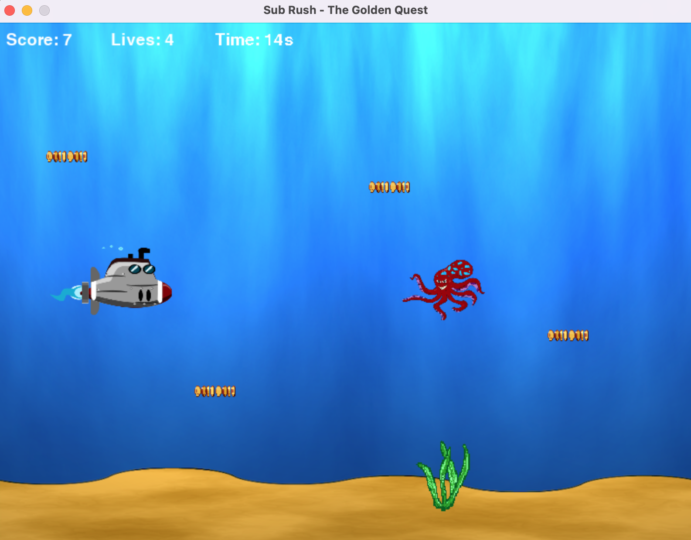

# Sub Rush – The Golden Quest

My first game built in Python using Pygame. A 2D game developed with a focus on game logic, interaction, and difficulty scaling.

## 🎮 Gameplay

The player controls a submarine, collects coins, and avoids obstacles like seaweed and octopuses.

The goal is to reach 100 points as fast as possible while managing lives and avoiding collisions. As the score increases, the game becomes more difficult.

## 📸 Screenshot


*Example gameplay showing the submarine, coins, and obstacles.*

## 🛠 Tech
- Python
- Pygame

## 🚀 How to run

Make sure Python is installed, then install Pygame:

```bash
pip install pygame
python sub_rush.py
